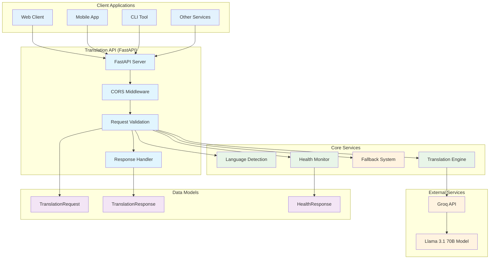
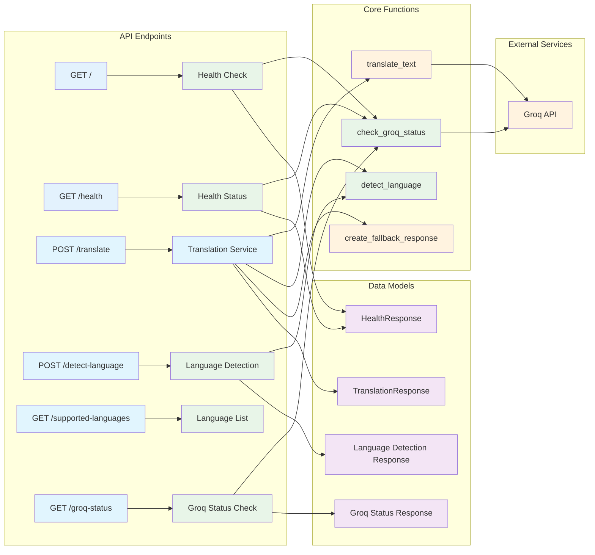
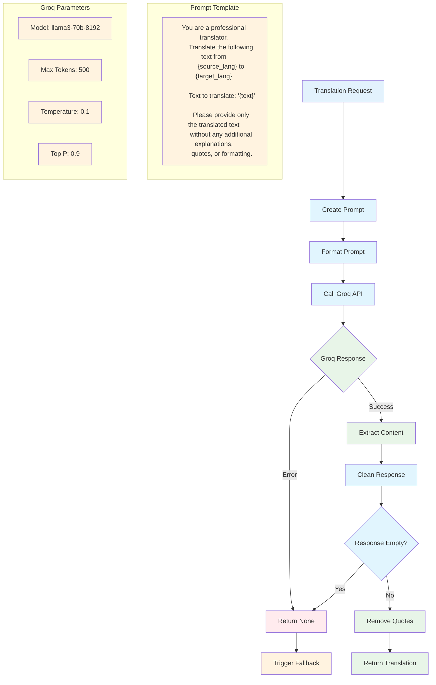
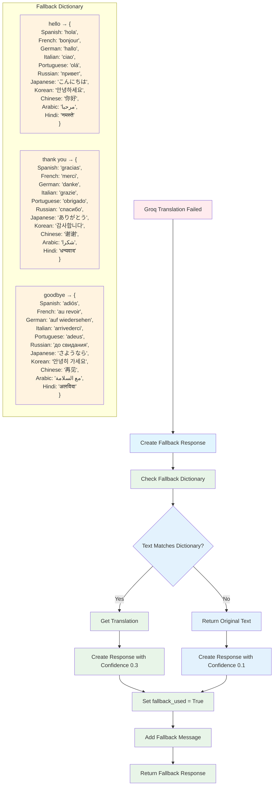
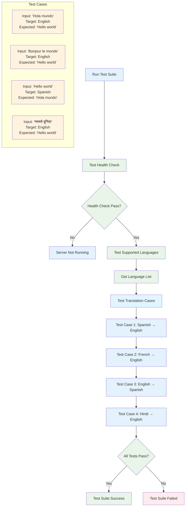
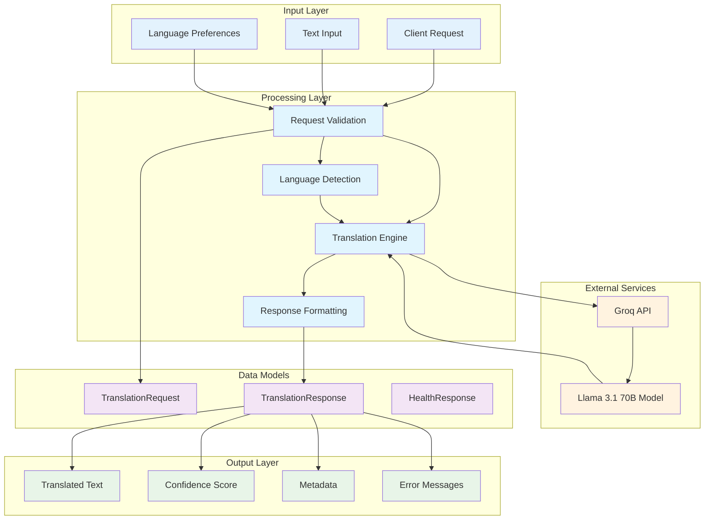

# Translation API - Mermaid Flow Diagrams

## 1. System Architecture Overview



## 2. Translation Process Flow

```mermaid
flowchart TD
    A[Client Request] --> B{Validate Request}
    B -->|Invalid| C[Return 400 Error]
    B -->|Valid| D[Parse Request Body]
    
    D --> E{Source Language Provided?}
    E -->|Yes| F[Use Provided Language]
    E -->|No| G[Auto-detect Language]
    
    G --> H[Detect Language]
    H --> I{Detection Successful?}
    I -->|No| J[Set as "Unknown"]
    I -->|Yes| K[Use Detected Language]
    
    F --> L{Source = Target?}
    K --> L
    J --> L
    
    L -->|Yes| M[Return Original Text]
    L -->|No| N[Check Groq Status]
    
    N --> O{Groq Available?}
    O -->|No| P[Use Fallback System]
    O -->|Yes| Q[Call Groq API]
    
    Q --> R{Groq Response Success?}
    R -->|No| P
    R -->|Yes| S[Process Translation]
    
    P --> T[Check Fallback Dictionary]
    T --> U{Fallback Available?}
    U -->|Yes| V[Return Fallback Translation]
    U -->|No| W[Return Original Text]
    
    S --> X[Clean Response]
    X --> Y[Create Response Object]
    V --> Y
    W --> Y
    M --> Y
    
    Y --> Z[Return Response to Client]
    
    style A fill:#e3f2fd
    style B fill:#e1f5fe
    style C fill:#ffebee
    style D fill:#e1f5fe
    style E fill:#e1f5fe
    style F fill:#e3f2fd
    style G fill:#e3f2fd
    style H fill:#e8f5e8
    style I fill:#e8f5e8
    style J fill:#e3f2fd
    style K fill:#e3f2fd
    style L fill:#e1f5fe
    style M fill:#e8f5e8
    style N fill:#e1f5fe
    style O fill:#fff3e0
    style P fill:#fff3e0
    style Q fill:#e1f5fe
    style R fill:#e8f5e8
    style S fill:#e8f5e8
    style T fill:#fff3e0
    style U fill:#fff3e0
    style V fill:#fff3e0
    style W fill:#fff3e0
    style X fill:#e8f5e8
    style Y fill:#e8f5e8
    style Z fill:#e8f5e8
```

## 3. API Endpoints Flow



## 4. Language Detection Process

```mermaid
flowchart TD
    A[Input Text] --> B[langdetect.detect]
    B --> C{Detection Result}
    
    C -->|Success| D[Get Language Code]
    C -->|Failure| E[Return "Unknown"]
    
    D --> F[Language Code Mapping]
    F --> G{Code in Map?}
    G -->|Yes| H[Return Full Language Name]
    G -->|No| I[Return Title Case]
    
    H --> J[Detected Language]
    I --> J
    E --> J
    
    subgraph "Language Code Examples"
        K[en → English]
        L[es → Spanish]
        M[fr → French]
        N[de → German]
        O[ja → Japanese]
        P[zh → Chinese]
        Q[ar → Arabic]
        R[hi → Hindi]
    end
    
    style A fill:#e3f2fd
    style B fill:#e8f5e8
    style C fill:#e8f5e8
    style D fill:#e3f2fd
    style E fill:#e3f2fd
    style F fill:#e3f2fd
    style G fill:#e3f2fd
    style H fill:#e3f2fd
    style I fill:#e3f2fd
    style J fill:#e8f5e8
    style K fill:#e3f2fd
    style L fill:#e3f2fd
    style M fill:#e3f2fd
    style N fill:#e3f2fd
    style O fill:#e3f2fd
    style P fill:#e3f2fd
    style Q fill:#e3f2fd
    style R fill:#e3f2fd
```

## 5. Groq Translation Flow



## 6. Fallback System Flow



## 7. Error Handling Flow

```mermaid
flowchart TD
    A[API Request] --> B{Request Validation}
    B -->|Invalid| C[HTTP 400 Bad Request]
    B -->|Valid| D[Process Request]
    
    D --> E{Language Detection}
    E -->|Failed| F[Set Language as "Unknown"]
    E -->|Success| G[Continue Processing]
    
    F --> G
    G --> H{Groq Available?}
    H -->|No| I[HTTP 503 Service Unavailable]
    H -->|Yes| J[Attempt Translation]
    
    J --> K{Translation Success?}
    K -->|No| L[Use Fallback System]
    K -->|Yes| M[Return Success Response]
    
    L --> N{Fallback Available?}
    N -->|Yes| O[Return Fallback Response]
    N -->|No| P[Return Original Text]
    
    subgraph "Error Types"
        Q[400 - Bad Request]
        R[500 - Internal Server Error]
        S[503 - Service Unavailable]
    end
    
    subgraph "Error Messages"
        T["Groq service not available. 
        Please ensure your Groq API key is valid."]
        U["Translation failed: {error_details}"]
        V["Language detection failed: {error_details}"]
    end
    
    style A fill:#e3f2fd
    style B fill:#e1f5fe
    style C fill:#ffebee
    style D fill:#e1f5fe
    style E fill:#e8f5e8
    style F fill:#e3f2fd
    style G fill:#e1f5fe
    style H fill:#e3f2fd
    style I fill:#ffebee
    style J fill:#e1f5fe
    style K fill:#e3f2fd
    style L fill:#fff3e0
    style M fill:#e8f5e8
    style N fill:#e3f2fd
    style O fill:#e8f5e8
    style P fill:#e3f2fd
    style Q fill:#e3f2fd
    style R fill:#e3f2fd
    style S fill:#e3f2fd
    style T fill:#fff3e0
    style U fill:#fff3e0
    style V fill:#fff3e0
```

## 8. Startup and Initialization Flow

```mermaid
flowchart TD
    A[Start Application] --> B[Import Dependencies]
    B --> C[Initialize FastAPI App]
    C --> D[Add CORS Middleware]
    D --> E[Configure Logging]
    
    E --> F[Set Groq Configuration]
    F --> G[Initialize Groq Client]
    G --> H{Test Groq Connection}
    
    H -->|Success| I[Log Success]
    H -->|Failure| J[Log Error]
    
    I --> K[Start Uvicorn Server]
    J --> K
    
    K --> L[API Ready on Port 8000]
    
    subgraph "Configuration"
        M[GROQ_API_KEY = "XXX"]
        N[GROQ_MODEL = "llama3-70b-8192"]
        O[Host = "0.0.0.0"]
        P[Port = 8000]
    end
    
    subgraph "Available Endpoints"
        Q[GET / - Health Check]
        R[GET /health - Health Status]
        S[POST /translate - Translation]
        T[POST /detect-language - Language Detection]
        U[GET /supported-languages - Language List]
        V[GET /groq-status - Groq Status]
    end
    
    style A fill:#e3f2fd
    style B fill:#e1f5fe
    style C fill:#e1f5fe
    style D fill:#e1f5fe
    style E fill:#e8f5e8
    style F fill:#e1f5fe
    style G fill:#e1f5fe
    style H fill:#e8f5e8
    style I fill:#e8f5e8
    style J fill:#ffebee
    style K fill:#e1f5fe
    style L fill:#e8f5e8
    style M fill:#fff3e0
    style N fill:#fff3e0
    style O fill:#fff3e0
    style P fill:#fff3e0
    style Q fill:#e3f2fd
    style R fill:#e3f2fd
    style S fill:#e3f2fd
    style T fill:#e3f2fd
    style U fill:#e3f2fd
    style V fill:#e3f2fd
```

## 9. Testing Flow



## 10. Data Flow Architecture



---

## Usage Instructions

These Mermaid diagrams can be used in:

1. **GitHub Markdown** - Copy and paste directly into README.md
2. **Documentation** - Include in technical documentation
3. **Presentations** - Use in slides or technical presentations
4. **Development Tools** - Many IDEs support Mermaid rendering
5. **Online Mermaid Editor** - Visit https://mermaid.live to edit and export

## Diagram Types Included

1. **System Architecture** - Overall system design
2. **Translation Process** - Main translation workflow
3. **API Endpoints** - All available endpoints and their flows
4. **Language Detection** - How language detection works
5. **Groq Translation** - Detailed Groq API integration
6. **Fallback System** - Fallback translation mechanism
7. **Error Handling** - Comprehensive error handling flow
8. **Startup Process** - Application initialization
9. **Testing Flow** - Test suite execution
10. **Data Flow** - Data transformation through the system

Each diagram provides a different perspective on the Translation API system, making it easier to understand the architecture, processes, and data flow.
